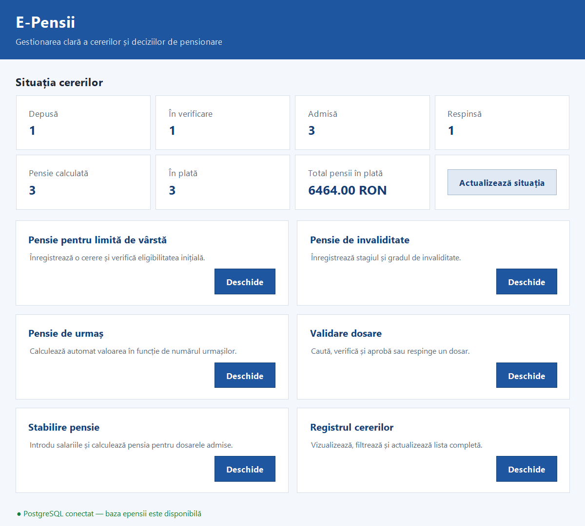
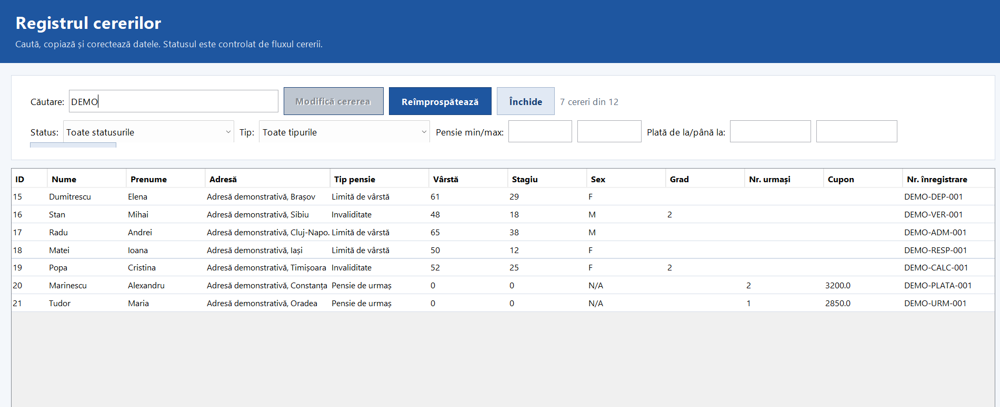
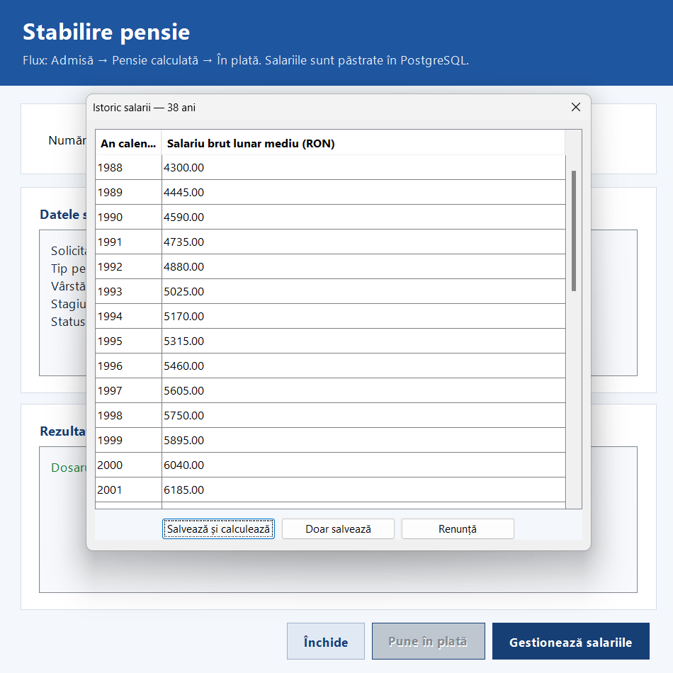
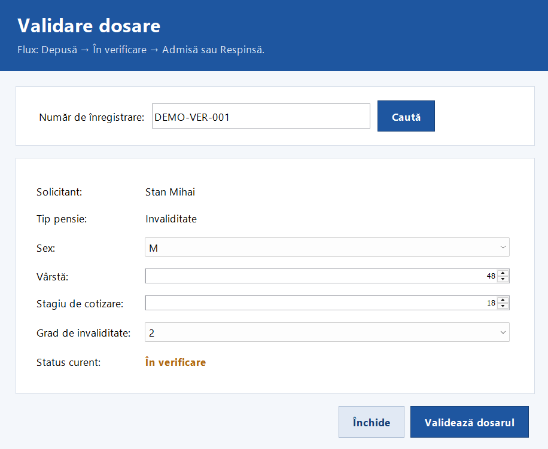
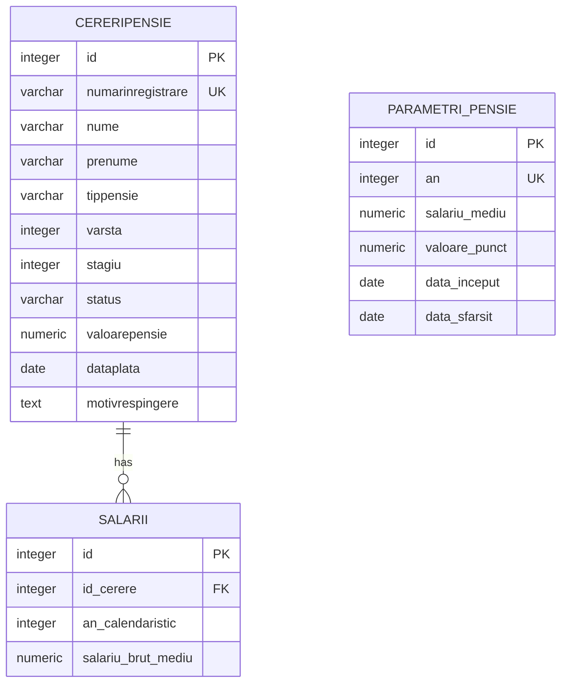

# E-Pensii

[Română](README.md) | **English**

A Java desktop application for managing pension requests with Swing and PostgreSQL. The project covers the complete lifecycle of a request, from submission and verification to pension calculation and payment.

> [!IMPORTANT]
> This is an educational project. Its rules, thresholds, and calculation values are provided for demonstration purposes and do not represent official Romanian pension legislation.

## Screenshots

<table>
  <tr>
    <td width="50%"><strong>Dashboard</strong><br></td>
    <td width="50%"><strong>Request registry</strong><br></td>
  </tr>
  <tr>
    <td width="50%"><strong>Salary history</strong><br></td>
    <td width="50%"><strong>Request validation</strong><br></td>
  </tr>
</table>

## Features

- requests for retirement age, disability, and survivor pensions;
- controlled workflow: `Submitted → Under review → Approved/Rejected → Pension calculated → In payment`;
- mandatory rejection reason;
- editable request registry with sorting, text selection, copying, and advanced filters;
- salary history management using calendar years;
- centralized pension calculation based on parameters stored in PostgreSQL;
- atomic transactions for salary persistence and recalculation;
- dashboard showing request counts and the total value of pensions in payment;
- single-instance behavior for each application window;
- PostgreSQL constraints and triggers that protect data integrity.

## Technology stack

- Java 17+
- Java Swing
- PostgreSQL
- JDBC
- Maven
- GitHub Actions

## Architecture

The application follows a layered architecture:

```text
ui → service → repository → PostgreSQL
       ↓
     model
```

- `model` — domain entities and enums;
- `repository` — PostgreSQL persistence operations;
- `service` — validation, workflow coordination, and business rules;
- `ui` — Swing windows and components;
- `app` — application entry point.

Additional details are available in [ARHITECTURA.md](ARHITECTURA.md).

## Database schema

The diagram shows the persistent entities and the relationship between requests and salary history:



`SALARII.id_cerere` references `CERERIPENSIE.id`. `PARAMETRI_PENSIE` is queried by year and validity interval during calculation and therefore does not require a direct foreign key.

## Setup

### Requirements

- JDK 17 or newer;
- Maven 3.9+;
- PostgreSQL.

### Database

Run the scripts in the following order:

1. `database/01_create_database.sql` while connected to the `postgres` database;
2. `database/02_schema.sql` while connected to the newly created `epensii` database;
3. optionally, `database/05_demo_portofoliu.sql` to add fictitious portfolio data.

Scripts `03` and `04` are migration scripts for older installations.

### Connection configuration

The application reads its connection settings from environment variables:

```powershell
$env:EPENSII_DB_URL = "jdbc:postgresql://localhost:5432/epensii"
$env:EPENSII_DB_USER = "postgres"
$env:EPENSII_DB_PASSWORD = "your_postgresql_password"
```

Never store the real database password in the source code or repository.

### Run the application

```powershell
mvn clean compile exec:java
```

The entry point is `app.Main`.

## Verification

Build the project and compile the integration check with:

```powershell
mvn clean verify
```

`integration.FluxIntegrareCheck` verifies the complete workflow, salary persistence, recalculation, mandatory rejection reasons, and PostgreSQL constraints. It uses a locally configured database and removes its temporary data after completion.

## Database structure

- `cereripensie` — request data, workflow status, decision, and pension result;
- `salarii` — yearly salary history associated with a request;
- `parametri_pensie` — yearly average salary and pension point values.

## License

This project is available under the [MIT License](LICENSE).
